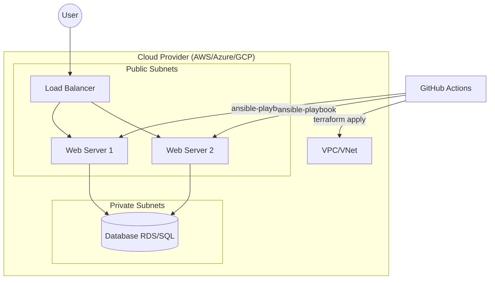

# CloudIaC-Kit Multi-Cloud IaC Starter Kit

[](https://github.com/MichelRolandOkoubi/CloudIaC-Kit/actions/workflows/lint-security.yml)
[](https://github.com/MichelRolandOkoubi/CloudIaC-Kit/actions/workflows/terraform-plan.yml)
[](https://opensource.org/licenses/MIT)
[](https://github.com/pulsar-jvm/pulsar)


A production-ready Infrastructure as Code (IaC) template supporting AWS, Azure, and GCP. This kit demonstrates architectural best practices, CI/CD integration, and pedagogical documentation in English and French.

## ⚡ Quickstart

Deploy the AWS Dev environment in 3 steps:

1. **Configure Credentials**:
   ```bash
   export AWS_ACCESS_KEY_ID="your_key"
   export AWS_SECRET_ACCESS_KEY="your_secret"
   ```
2. **Initialize & Apply**:
   ```bash
   cd terraform/environments/dev/aws
   terraform init && terraform apply -var="db_password=securepassword123"
   ```
3. **Configure Servers**:
   ```bash
   cd ../../../../ansible
   ansible-playbook -i <instance_ip>, site.yml
   ```

## 🚀 Overview

This repository provides reusable Terraform modules and Ansible playbooks to deploy a standardized web architecture across multiple cloud providers. It is designed both as a production template and as a learning resource.

### 🎓 Educational Highlights

- **Bilingual Documentation**: Every file contains detailed comments in **English** and **French** explaining the *why* behind each resource.
- **Architectural Patterns**: Demonstrates VPC isolation, public/private subnet logic, and tiered security.
- **Best Practices**: Integrated linting, security scanning, and managed database patterns.

### 🏗 Architecture Diagram



## 🛠 Features

- **Multi-Cloud Support**: Modular design for AWS, Azure, and GCP.
- **Security First**: 
  - Integrated **Checkov** for security scanning.
  - **TFLint** for infrastructure linting.
  - Private subnets for databases.
- **CI/CD Driven**: GitHub Actions workflows for automated testing and deployment.
- **Configuration Management**: Ansible roles for Nginx setup and OS hardening.

## 📂 Structure

- `terraform/modules/`: Cloud-specific resource definitions.
- `terraform/environments/`: Environment-specific (Dev/Prod) orchestrations.
- `ansible/`: Configuration management playbooks.
- `.github/workflows/`: Automated CI/CD pipelines.

## 🏁 Getting Started

### Prerequisites
- Terraform >= 1.0
- Ansible >= 2.10
- Cloud credentials (AWS_ACCESS_KEY, etc.)

### Deployment (AWS Dev)
1. Initialize Terraform:
   ```bash
   cd terraform/environments/dev/aws
   terraform init
   ```
2. Plan changes:
   ```bash
   terraform plan
   ```
3. Apply:
   ```bash
   terraform apply
   ```

## 🔐 Security Checks

Run linting and security scans locally:
```bash
# TFLint
tflint

# Checkov
checkov -d .
```

---
*Created with ❤️ for Cloud Engineers.*
